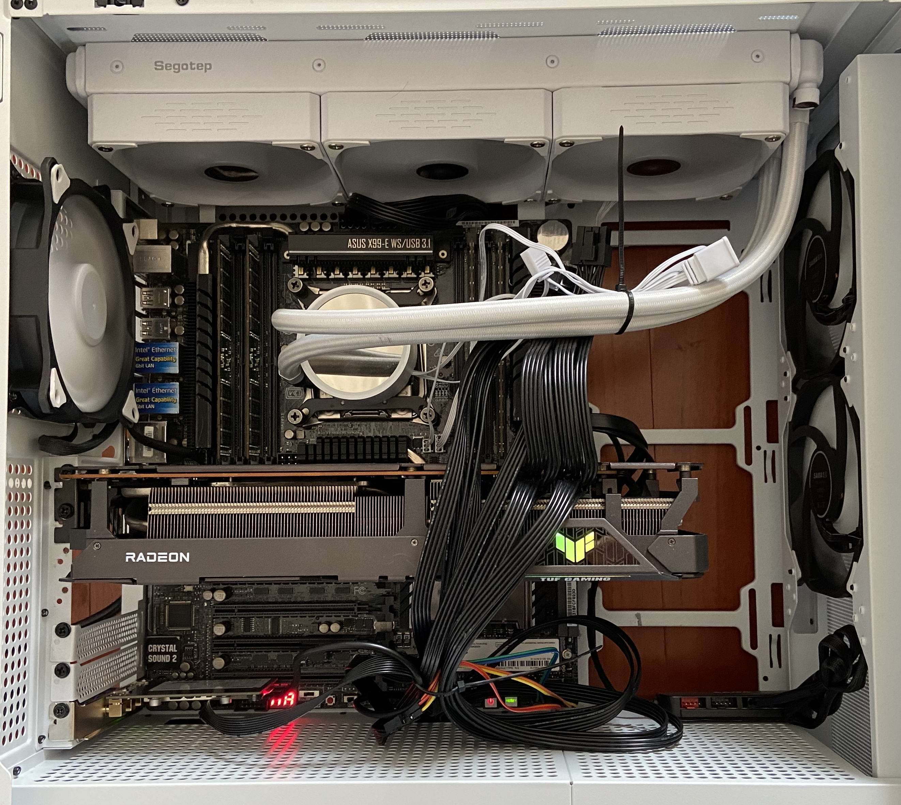
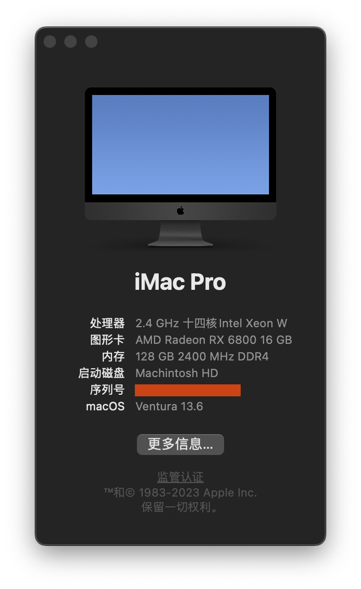

# hackintosh-asus-x99-ws-usb31

## hardware

* asus xx99 ws usb3.1
* Intel Xeon E5-2680 v4 @ 2.40GHz
* 128G DDR4
* AMD Radeon RX 6800
* Broadcom BCM43xx wireless and bt

## software

* Ventura 13.6.1
* opencore 0.9.5

## gallery

